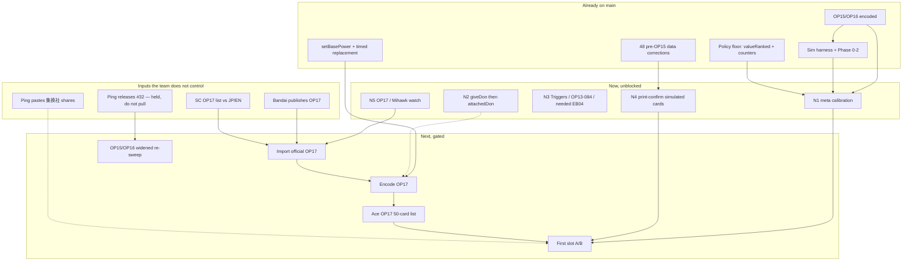

# Path — blockers, prerequisites, critical path

Parent: [`ROADMAP.md`](../../ROADMAP.md). Dated 2026-08-21 against `origin/main` @ `119cfe4`.

What is waiting on what. The charter originally named "encode OP15/16/17" as the critical path
because a leader-vs-leader matrix cannot answer a two-card slot. OP15/OP16 encoding is done.
The path below is the same job with the expired blocker removed.

## The job the path is for

Not "which deck is best." Ace is locked. The path exists so the team can answer:

> Which 1–2 cards on the Ace list raise field-weighted match win rate against the field Ping
> will actually face — and when is that answer a measurement rather than a policy artifact?

`ΔEV(c) = Σ share(archetype) × ΔWR(deck with c vs without c | archetype)`

A card dead outside a 10% matchup must swing that matchup by more than 9 points to break even.
That ΔWR is exactly what a weak or blind policy evaluates worst.

## Critical path (current)

Solid arrows are prerequisites. Dashed arrows are "improves trust" or "optional weighting", not
hard gates.

**The path that produces the first trustworthy slot number is:**

official OP17 → import → encode (using `setBasePower` already on main) → Ace OP17 list →
slot A/B, weighted by SC shares if present else labelled EN proxy, interpreted against a
calibration (N1) and a print-confirmed slice of the cards in those games (N4).

**Today that path is blocked on Bandai, not on an encoding backlog and not on #32.**

Work that can run *beside* the wait: N1, N2, N3, N4, N5. Those do not unlock OP17, but N1 and N4
are what later decide whether the slot number is real.

## Waiting on what

| This | Waits on | Does not wait on | If the wait slips |
|---|---|---|---|
| Ace OP17 list | Official card list + import | #32; search AI; SC shares | Keep the OP16 Ace list; do not freeze; do not encode spoilers |
| `OP17-005` encoding | Official text (import) | A new primitive. `setBasePower` is on main (#26/#31/#34) | Leave it unencoded. Do not re-reject the On Play |
| `OP17-016` slot question | Ace OP17 list + a field share table + a policy that can K.O. small bodies | Full print-confirmation of pre-OP15 | Ask it on the EN proxy and label it |
| OP17 encoding batch | Import | #32; giveDon / attachedDon (neither is on this path) | Stay on Now |
| SC-weighted EV | Ping's 集换社 paste (pie + top-cut + event size/date) | A scraper. There is not one to build | Keep EN Limitless shares; say so every time |
| SC vs JP/EN OP17 list parity | Official SC list (charter open question) | Banlist/rotation parity (already confirmed) | Do not assume the lists are identical |
| Meta calibration (N1) | Frozen `ace-op16.json` + frozen Limitless modal lists for Nami, G/B Luffy, Enel, Teach | Official OP17; #32; **集换社 / SC shares**; search AI; a Limitless Ace list | Run it. Do not hold. |
| Print-confirmation of the *field* | Time / a fidelity crew | Mutation re-sweep (#32). Detectability ≠ fidelity | Calibrate anyway; treat misses as maybe-encoding |
| Widened-instrument project record | **Ping releases #32** | Any Now milestone | Do not merge it. Keep quoting 62.3% as the `main` figure |
| OP15/OP16 mutation records on the new instrument | Same release, then a `--set --fresh` sweep | "Fixing" `runs/OP15.jsonl` on today's `main` | Leave the red gate alone |
| Fidelity-plan Phase 3 (counter weights) | A decision that derived weights are still the right next policy move; honesty about attack-target bias | OP17 | Size against Phase 2, not pre-Phase-1 |
| Attack-target selection | Ping reopening a 2026-08-19 deferral | A code insight. The mechanism is known (`targetIds[0]`, leader first) | Live with the bias: saved bodies are purely offensive |
| Blocking / Trigger-decline | An explicit policy decision. No waste-free rule exists for blocking | A missing engine primitive | Pinned unimplemented; do not "notice" them into existence |
| Event counters (`useEventCounters`) | A `selectTargets` policy. Today's resolver spends the Event and grants nothing | Flipping the knob | Keep the default `false` |
| Search AI / audit A–D | Calibration evidence that the heuristic *distorts* matchup WRs | Throughput panic. Throughput is not the binding constraint | Stay on the cheap policy |
| Oracle / human benchmark | A policy we claim is worth grading | Now work | Already deferred in `CLAUDE.md` |
| Teach-as-benchmark-deck | OP15/OP16 encodings — **expired 2026-08-18** | — | Available in principle; just has not been the bench deck |
| Upstream merge of #216 | Their maintainers | Us. Do not file, ping, or propose | Local `patch_engine.py` remains the mechanism |

## Prerequisite stacks (read before starting a Now pick)

### N1 — Meta calibration (locked)

Needs:

- Bootstrapped, patched engine (`./scripts/bootstrap.sh` from repo root so patches actually apply).
- Ace: current `sim/decks/ace-op16.json`, frozen. Not a Limitless Ace list.
- Opponents: frozen Limitless **modal** lists for Nami, G/B Luffy, Enel, Teach. Snapshot
  before the run; do not hit live Limitless on run day. Not ST01, not `mihawk-green-proxy`.
- The EN matrix (`data/op16-matchup-matrix.json`) as the comparison cell per matchup.
- Seat assignment to control play/draw (north leads; `MatchConfig.firstPlayer` is discarded).
  Record play/draw separately; the headline is the **blended** WR.
- **400 paired games** per matchup.
- Timed-out games **dropped**. Do not score them as double losses on this run, and do not
  report a timeout rate.

Does not need: official OP17, #32, 集换社 / SC shares, a new search policy, Phase 3 weights.
A miss is a measurement, not a gate.

Will be *biased by*: no character attack targets; no blocks; always-on Triggers; first-N on
non-counter `selectCards`; parked clauses silently absent; unconfirmed pre-OP15 encodings of
whatever those frozen lists actually play. Report those as the instrument, not as afterthoughts.

### N2 — `giveDonSourcePlayer` then `attachedDonTargetFilter`

Needs: isolated engine clone per batch; SC rulings for the blocked cards; mutation_check on
each newly encoded id. `giveDon` with `player: "any"` is wrong, not approximate (rulings
#854–#874). `attachedDonTargetFilter` for `OP15-031` must compare a candidate's attached DON!!
to *that candidate's own cost*.

Does not need: calibration, OP17, #32.

### N3 — Triggers / `OP13-084` / needed EB04

Needs: Limitless or Bandai text (base printing); encoding and printed trigger in the same
change; tests that can fail (`mutation_check.py`). `OP13-084` needs the fabricated `[On Play]`
replaced, not a text-only correction.

Does not need: #32. Do not wait for the widened sweep to fix a known wrong encoding.

### N4 — Print-confirm simulated cards

Needs: the exact decklists N1 will run; `tools/parse_rulings.py --card`; base text, not
variant text (`tools/variant_audit.py` is why).

Does not need: #32. A surviving mutant means the test would not catch a bad encode; a killed
mutant does not mean the encode matches the print.

### N5 — Watch

Needs: Limitless (robots allow fetch) or the official Bandai list. No aggregator.

Does not need: anything in this repo except the standing §5 table to diff against.

## What is *not* on the critical path

Say this out loud so it does not get staffed as if it were:

| Item | Why it feels critical | Why it is not |
|---|---|---|
| PR #32 | Newest open PR; mutation gate red on main | Held. Detectability records. Does not encode OP17, does not calibrate, does not pick a slot |
| Search AI / ISMCTS | Charter Phase 2 names it | Policy legality and policy *honesty* were the real binders. Lever undecided until calibration |
| `giveDon` / `attachedDon` | Next scoped primitives | No OP17 clause needs them. Do them in Now if there is an encoding crew |
| Remaining 15 singleton primitives | Parked list looks like backlog | Project rule: unscopable from one card, stay parked |
| 445 cards absent from the catalog | Large number | 199 are ST10–ST36; 117 are rotated ST01–ST09. Sim decks do not need them |
| 1,129 stub tests in OP01–OP08 / EB01–EB03 | "the suite is fake" | True that those files are `assert.ok(true)`. Not the path to a slot number. Later |
| Arena live LLM / Swiss / clock | Looks like "play policy" | An LLM cannot be the runtime policy at slot sample sizes. Arena is a corpus tool |
| Throughput / Rust port (audit A) | Old audit framing | Binding constraint moved. Do not spend on speed to sample a broken policy more precisely |
| Upstream #216 / #217 | Open on their repo | Standing rule: do not touch, do not ask. Local patches are the deliverable |

## Dependency on people, not code

| Person | Only they can | Crew substitute |
|---|---|---|
| Ping | Release or kill #32 | None. Work around it |
| Ping | Paste 集换社 pie + top-cut | EN proxy, labelled. Does not gate N1. |
| Ping | Reopen attack-target / blocking / Trigger-decline | Leave them pinned unimplemented |
| Ping | Call the tripwire (abandon Ace) | Report mechanism-level breakage; do not flip the archetype on EV rank |
| Bandai | Publish OP17 | Wait. Spoilers stay provisional |
| tcg-engines maintainers | Merge #216 | None, and do not ask |

## Sequencing rule for two crews in parallel

If two implementation crews are available before OP17:

- **Crew A (sim/policy):** N1 meta calibration. This is the locked next step.
- **Crew B (encoding/catalog):** N2 primitives, or N3/N4 on the *same lists* Crew A will run.

Do not give either crew #32. Do not give either crew "build search AI." Do not give either
crew "encode OP17 from spoilers."
